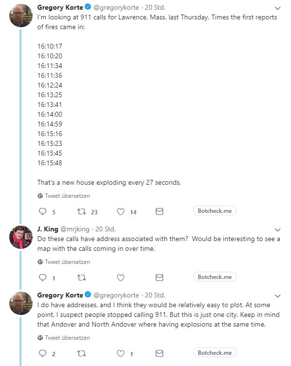
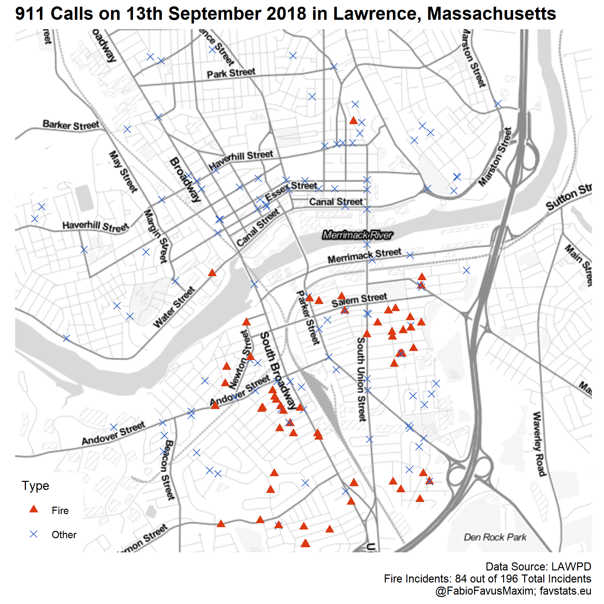
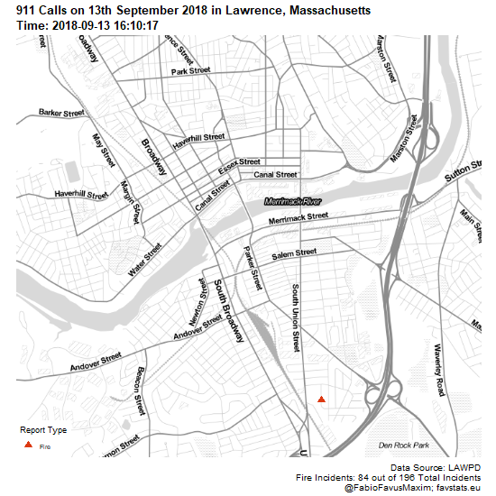

```{r, echo=F}
knitr::opts_chunk$set(message = F,  warning = F, error = F, 
                      fig.align = "center", 
                      fig.width = 10, fig.height = 6)
```


Yesterday, my good friend Ben tagged me in a tweet. 




And so an idea was born.

Data: http://www.lawpd.com/DocumentCenter/View/3672/09-13-2018


## Packages and Folders

```{r}
# Install these packages if you don't have theme yet
# devtools::install_github("dkahle/ggmap", ref = "tidyup")
# install.packages("pacman")

pacman::p_load(tidyverse, pdftools, ggmap, gganimate)
```

## Load Data

```{r}
firedata <- tidytemplate::load_it("data/firedata.Rdata")
```


## Static Map

```{r, eval = F}

lawrence <- c(left = -71.19, bottom = 42.68, right = -71.13, top = 42.72)
map <- get_stamenmap(lawrence, zoom = 14, maptype = "toner-lite")


firstmap <- ggmap(map) + # creates the map
  geom_point(aes(x = lon, y = lat, 
                 color = fire, shape = fire),                       # adding your data
             size = 2,
             data = firedata) +
  scale_shape_manual("Type", values= c(17, 4))+
  ggthemes::theme_map() +
  scale_colour_manual("Type", values = ggthemes::gdocs_pal()(2) %>% rev()) +
  labs(title = "911 Calls on 13th September 2018 in Lawrence, Massachusetts",
      caption = "Data Source: LAWPD\nFire Incidents: 84 out of 196 Total Incidents\n@FabioFavusMaxim; favstats.eu")  +
  theme(plot.title = element_text(size = 13, face = "bold"), 
    plot.caption = element_text(size = 8))
  
tidytemplate::ggsave_it(firstmap, width = 6, height = 6)

```


[](images/firstmap.png) 


## Animated

```{r, eval = F}

firedata <- firedata %>% 
  mutate(fire = ifelse(fire, "Fire", "Other"))

firedata <- firedata %>%
  distinct(lon, lat, .keep_all = T)

fire_anim <- ggmap(map) + # creates the map
  geom_point(aes(x = lon, y = lat, group = id,
                 color = fire, shape = fire),                       # adding your data
             size = 3,
             data = firedata %>% 
               filter(fire == "Fire")) +
  scale_shape_manual("Report Type", values= c(17, 4))+
  ggthemes::theme_map() +
  scale_colour_manual("Report Type", values = ggthemes::gdocs_pal()(2) %>% rev()) +
  labs(title = "911 Calls on 13th September 2018 in Lawrence, Massachusetts",
      subtitle = "Time: {closest_state}",
      caption = "Data Source: LAWPD\nFire Incidents: 84 out of 196 Total Incidents\n@FabioFavusMaxim; favstats.eu")  +
  theme(plot.title = element_text(size = 13, face = "bold"),
    plot.subtitle = element_text(size = 13, face = "bold"), 
    plot.caption = element_text(size = 10))  +  
  # geom_text(data = firedata,
            # aes(label = time, y = 42.719, x = -71.179), size = 6) +
  transition_states(datetime, 1, 1, wrap = T) +
  shadow_mark()


fire_anim %>% animate(
  nframes = 500, fps = 10, width = 550, height = 550, detail = 1
)

anim_save("images/fire_anim.gif")

```

[](images/fire_anim.gif) 